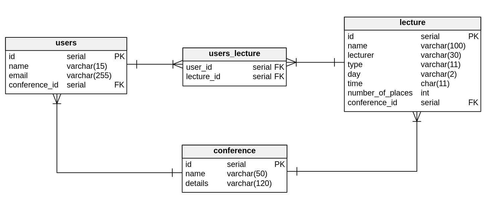

# Conference

### Table of Contents
* [General info](#general-info)
* [Duration](#duration)
* [Technologies](#technologies)
* [Prerequisites](#prerequisites)
* [Getting started](#getting-started)
* [Database](#database)
* [Tests](#tests)

### General info
This project is a recruitment task for Junior Java Developer in one of the companies.

### Duration
I started to create this web application on 15 May and ended on 20 May. 

### Technologies

<b>Back-end</b>
* Java 8
* Maven
* Spring (Boot, Data)
* Hibernate
* JPA
* H2 Database
* Lombok

<b>Front-end</b>
* Vaadin 8

<b>Tests</b>
* Groovy
* Spock

<b>Tools</b>
* IntelliJ IDEA

### Prerequisites

* Java 8
* Maven

### Getting started

Run the following commands:
```
git clone https://github.com/RobertKrzywina/Conference.git
cd Conference
./mvnw spring-boot:run
```

After that, go to http://localhost:8080 and see my application.

### Database

Database can be found at http://localhost:8080/h2

<b>Driver Class:</b> org.h2.Driver<br/>
<b>JDBC URL:</b> jdbc:h2:~/conference<br/>
<b>Username:</b> admin<br/>
<b>Password:</b> <br/>



### Tests

Left click on src/test/groovy folder and select "Run 'Tests in groovy'"

